# Hephaestus

Browser extension with improvements for █████████ and ████████ ██████.

## Installation

[Installation guide [PL]](https://ifv.banocean.com) 
[Adding the extension to browsers for development](#development-workflow)

## Features

    
Mobile navigation

| Before:                                                            | After:                                                            |
| ------------------------------------------------------------------ | ----------------------------------------------------------------- |
| 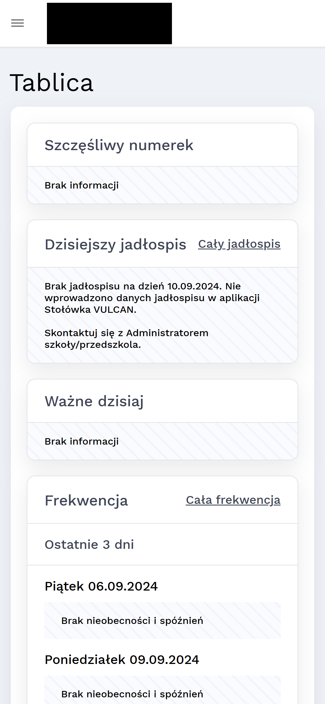 | 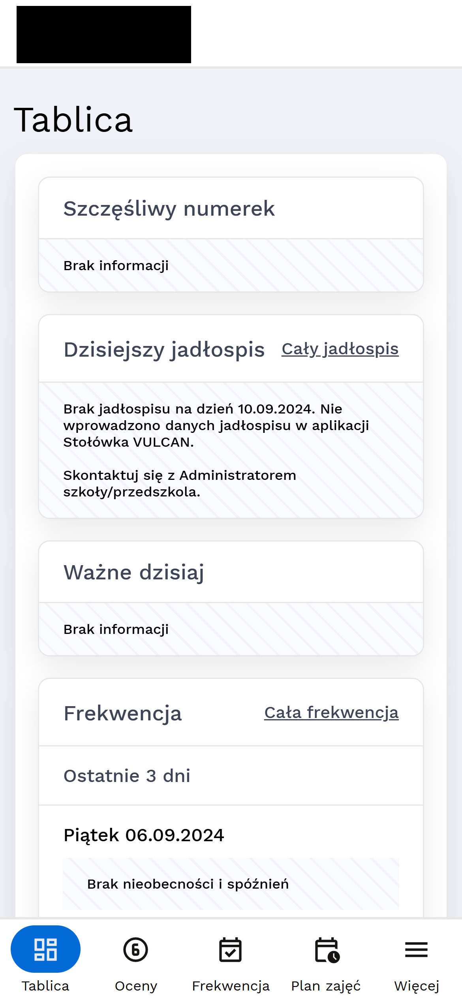 |

    
PWA support

    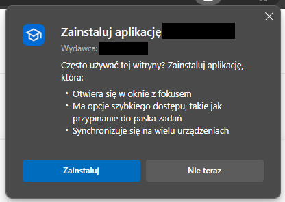

    
Attendance statistics in a separate tab

| Before:                                                             | After:                                                             |
| ------------------------------------------------------------------- | ------------------------------------------------------------------ |
| 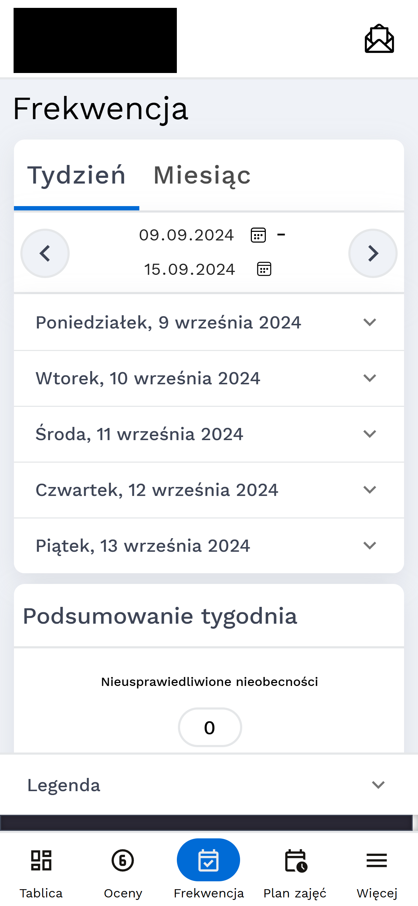 | 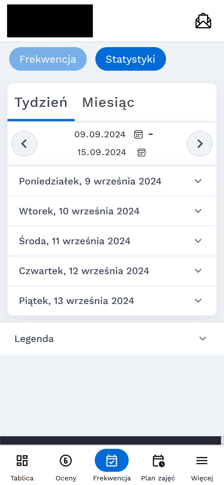 |

    
Hide weekends in monthly calendars

| Before:                                                               | After:                                                               |
| --------------------------------------------------------------------- | -------------------------------------------------------------------- |
| 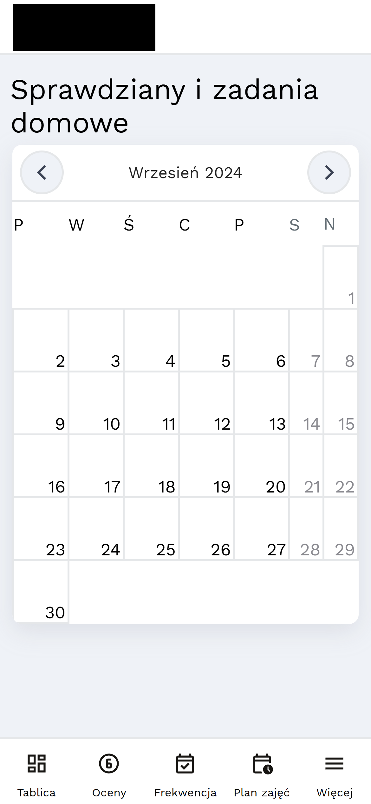 | 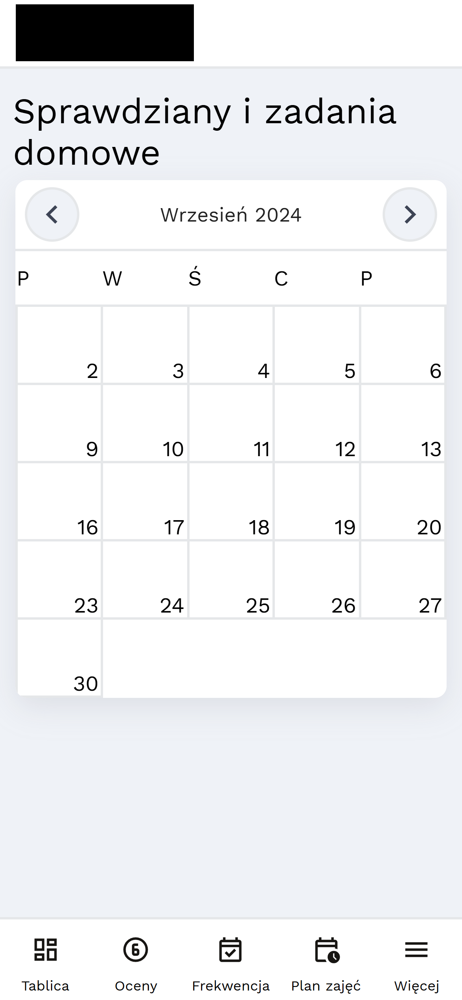 |

    
Display full name

| Before:                                                        | After:                                                        |
| -------------------------------------------------------------- | ------------------------------------------------------------- |
|  |  |

    
A cleaner student dashboard

Before:

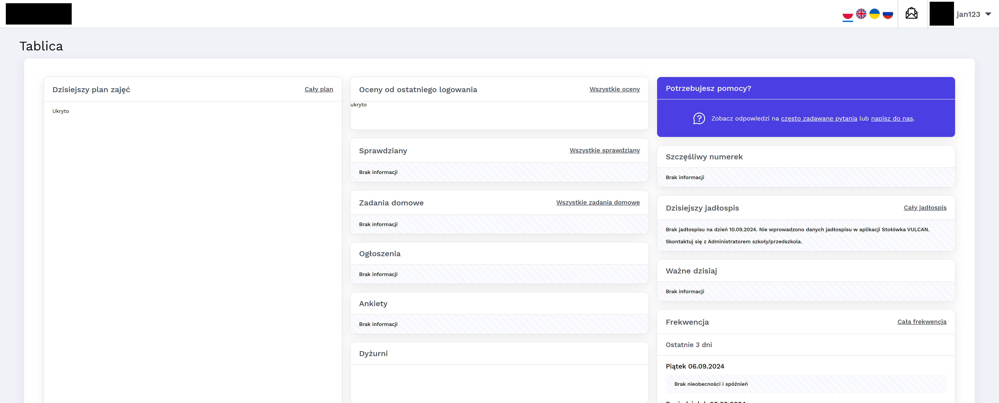

After:

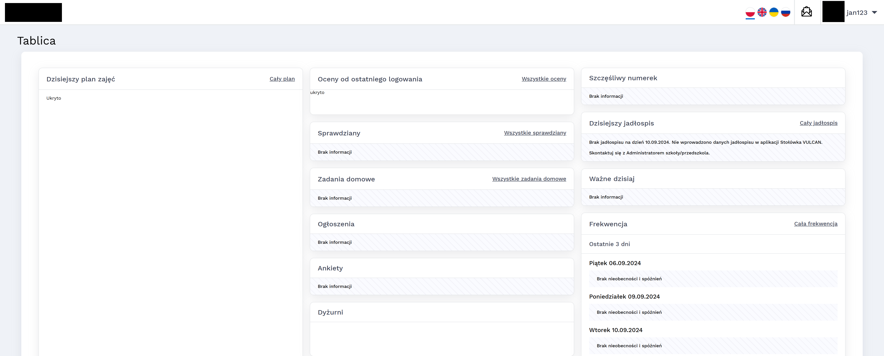

    
A cleaner █████████ home

| Before:                                                         | After:                                                         |
| --------------------------------------------------------------- | -------------------------------------------------------------- |
|  | 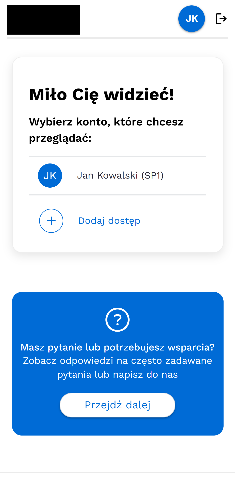 |

    
Other minor enhancements

- Hiding WCAG controls
- Aligning detailed grades button
- Redirecting to board
- Auto-redirecting to █████████ login page
      

## Development Workflow

### Build the extension

1. Make sure you have [Bun](https://bun.sh/) installed.
2. Install required dependencies and setup project using `bun install`.
3. Execute `bunx wxt prepare` to prepare types for futher development.
4. Use `bun dev`/`dev:firefox` to start development server or `bun build`/`bun build:firefox` to build a package.

### Firefox

To load add-on from files in Firefox, you need to go to `about:debugging#/runtime/this-firefox` and click `Load Temporary Add-on...`. After that you need to select the `manifest.json` file from `.output/` folder in the file picker. 
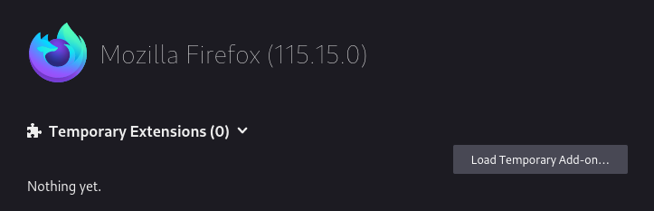

### Chrome

To load extension from files in Chrome, you need to go to `chrome://extensions/` and click `Load unpacked` (with Developer mode enabled) 
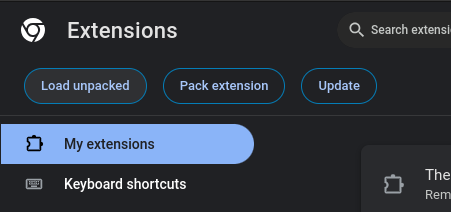

## License

This project is licensed under the [MIT License](./LICENSE).

## Contributions

Contributions to this project are welcome. Feel free to [open issues](https://github.com/yoper12/ifv/issues) and [submit pull requests](https://github.com/yoper12/ifv/pulls).
